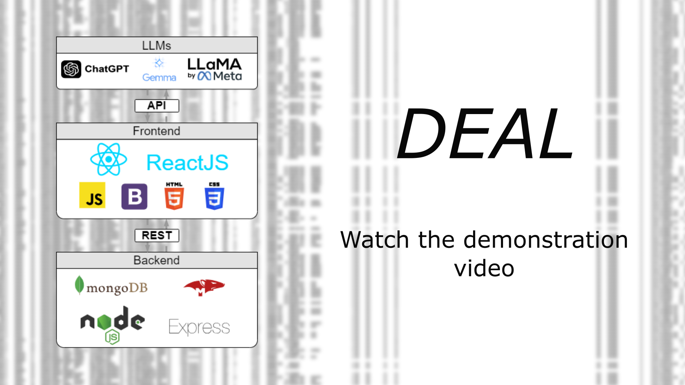

# DEAL: A visual tool for the analysis and interpretation of dependencies

The DEAL tool (Dependencies Explanation with Advanced Language Models) aims to address the problems of the lack of standardisation of the output format of dependency discovery algorithms and the problem of identifying spurious results and interpreting dependencies.

Providing a standard JSON format for organizing the results of dependency discovery,
an interface that allows them to be visualized in a simple and intuitive manner also allowing interactions with results such as filtering and displaying statistics related to individual columns, it
exploit the potential of Large Language Models (LLM) to provide semantic meaning to dependencies.

[](video/deal.mp4)


## Requirements

1. MongoDB - https://www.mongodb.com
2. NodeJS - https://nodejs.org
3. Anaconda (suggested) - https://www.anaconda.com

## Installation steps

1. [Dependencies Formatter](jef/README.MD)
2. [Backend](webtool/backend/README.MD)
3. [Frontend](webtool/frontend/README.MD)

## Run project

Run Backend (from folder webtool/backend)
```
node server.js -p listern_port -m mongodb_connection_url
```

Run Frontend  (from folder webtool/frontend)
```
npm start
```

For information on the execution parameters and their modification, please refer to the respective README.MD

